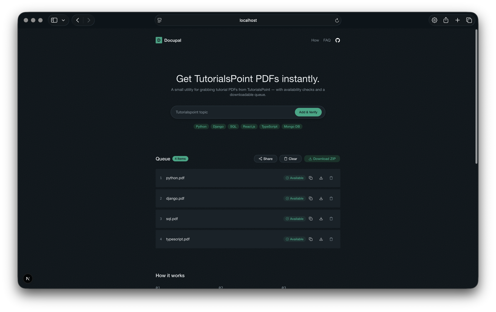

# Docupal



A simple web app for downloading TutorialsPoint PDFs — purpose-built to feed structured learning material into [NotebookLM](https://notebooklm.google.com/) and similar AI-powered study tools.

## Overview

TutorialsPoint has been a go-to resource for self-taught developers for years. Its tutorials are clear, structured, and beginner-friendly — exactly the kind of source that pairs well with AI notebooks like NotebookLM. The problem is getting those tutorials into a format you can actually upload.

Docupal solves that. You type in a topic, it verifies the PDF exists, and you download it — one at a time or as a batch zip. No scraping, no extensions, no scripts. Just a clean interface over TutorialsPoint's publicly available PDF exports.

## Features

- **Topic queue** — Add multiple topics at once and manage them in a persistent queue
- **PDF verification** — Checks the PDF signature before queueing to catch invalid topics early
- **Single download** — Download any verified topic directly as a `.pdf` file
- **Batch download** — Export the entire queue as a single `.zip` archive
- **Retry support** — Re-queue topics that failed to resolve
- **Persistent state** — Queue survives page refreshes via `localStorage`
- **Dark mode** — System-aware theme with manual toggle
- **Topic suggestions** — Curated list of popular TutorialsPoint topics to get started quickly

## How It Works

1. **Enter a topic** — Type the name of any TutorialsPoint tutorial (e.g., `python`, `react`, `sql`)
2. **Verify** — Docupal fetches the first bytes of the PDF and checks for a valid PDF signature before adding it to your queue
3. **Download** — Save individual PDFs or batch-export the whole queue as a zip

All requests to TutorialsPoint are proxied through a Next.js API route, which handles redirects, validates the content type, and streams the file directly to your browser.

## Installation

**Prerequisites:** Node.js 18+, pnpm

1. Clone the repository and install dependencies.

```bash
git clone https://github.com/WannaCry081/docupal.git
cd docupal
pnpm install
pnpm dev
```

1. Open [http://localhost:3000](http://localhost:3000) in your browser and start downloading topics.

```bash
pnpm build
```

## Contributing

Contributions are welcome. To get started:

1. Fork the repository
2. Create a feature branch: `git checkout -b feat/your-feature`
3. Commit your changes: `git commit -m "feat: add your feature"`
4. Push to your branch: `git push origin feat/your-feature`
5. Open a pull request

Please keep pull requests focused and scoped to a single concern.

## License

[MIT](./LICENSE)
